# 微信公众号(移动端web)

## 如何查看
1. 通过`HBuilderX`工具打开`uniapp_project`文件夹
2. 将`/common/we7_js/siteinfo.js`中的微信公众号的部分改为自己微擎后端对应的数据
```js
// #ifdef H5
const siteInfo = {
	'name': 'chenyu_uniapp', //你的模块名称
	'title': '',//标题名
	'uniacid': '1',//微擎区分公众号，小程序，app等平台的id
	'acid': '1',//微擎区分公众号，小程序，app等平台的id
	'multiid': '0',
	'version': '1.0.0',//版本号，和你后台创建的版本号要对应
	'siteroot': 'https://weiqing.chenyuwulu.top/app/index.php'//你的微擎域名地址
}
// #endif
```
3. 根据`HBuilderX`工具所提供的运行功能，运行对应的微信开发工具查看。

## 基本概念
uniapp下开发的h5端，总体上来说和vue的h5端是一样的，基本可以通用，并且在可以使用所有h5端的特性（dom节点和window）内又可以用uni的api。但是在实际情况下，如果你只是开发网页端，显然没必要用uniapp，既然你用了uniapp，我就当你是要活用uniapp的跨小程序和app端的能力了。所以尽可能避免dom。

**<font color=#840228 size=4>
本示例的微擎服务器是正常的线上服务器，能用https正常访问的线上服务器，如果是采用本地模拟环境的话，请自行替换后面说的服务器概念。
</font>**

## 如何开发调试
### 前期准备
**<font color=#2585a6 size=3>uniapp端的操作</font>**

我采用尽可能简单的概念来进行开发。以下就是我调试开发h5的配置，关于index.html模板和路由模式，请直接搜索vue相关的说明。至 运行的基础路径 下的配置是我发布的时候微擎要放编译后文件的目录。

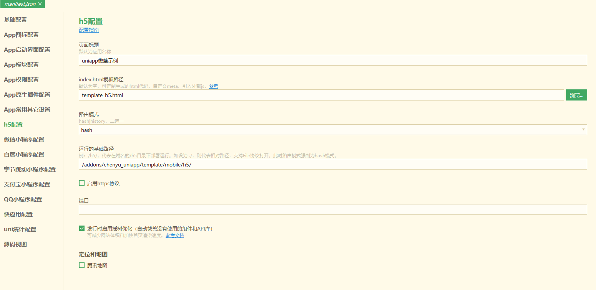

并且将siteinfo中h5的配置改成自己微擎端的uniacid和域名

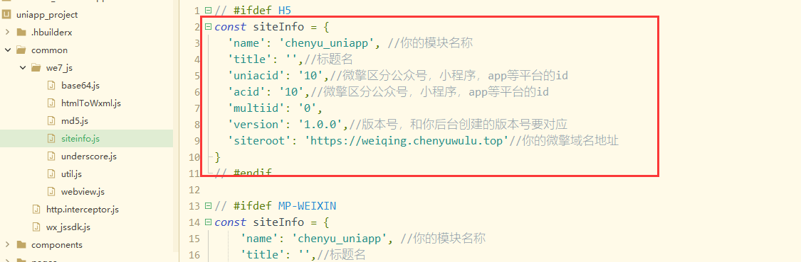

**<font color=#2585a6 size=3>微擎端的操作</font>**

将自己要用来开发测试的微擎后端的一个php文件注释掉一部分代码，主要是为了避免微擎自身封装的授权公众号信息的方法，因为会干扰前后端分离的模式。当你开发完毕后发布线上版或是发布商城售卖，就不需要注释这个了，注释这个只是在开发阶段

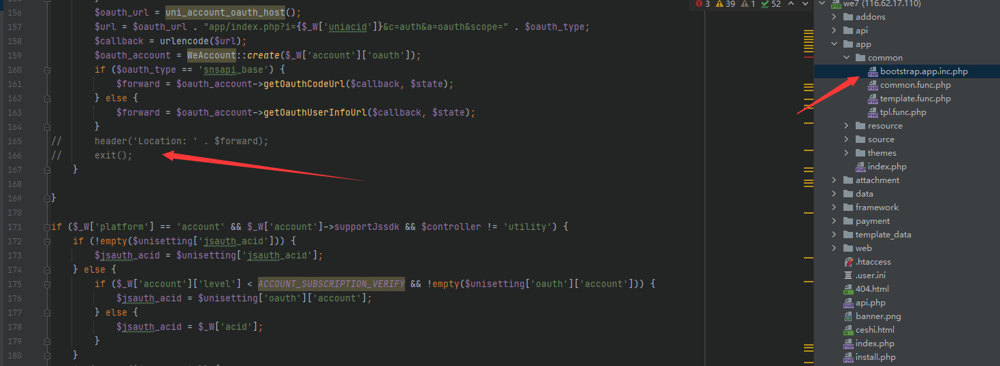

在site.php文件头部加入允许所有跨域，不然你的开发调试阶段，会警告跨域问题

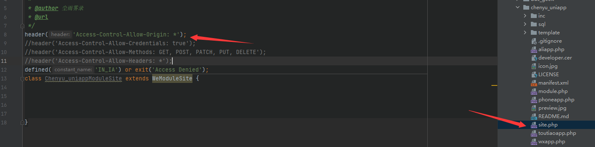

至于为什么我不把方法写在site.php里而是放在inc/mobile/weixin_jssdk.inc.php文件里，请自行参考微擎相关的文档。这只是为了方便管理。其次方法编写的最大不同就是，原本微擎的是直接include打开html文件的结尾，变成了我写的传值的回调，这部分方法可自行封装定义，我这边的例子只是最简单的展示。

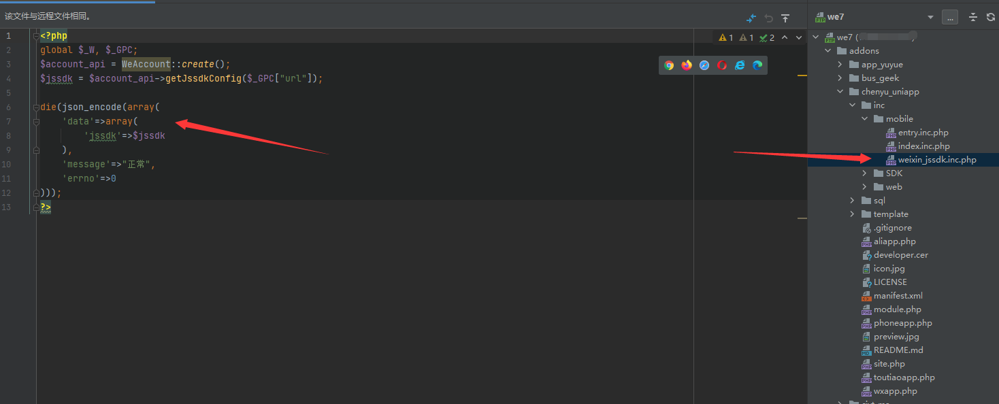

### 开发过程

由于uniapp开发h5端和vue开发h5端是一致的，所以无论是理论上还是实际上，uniapp这边是可以自由使用vue环境所有特性，比如vue devtools

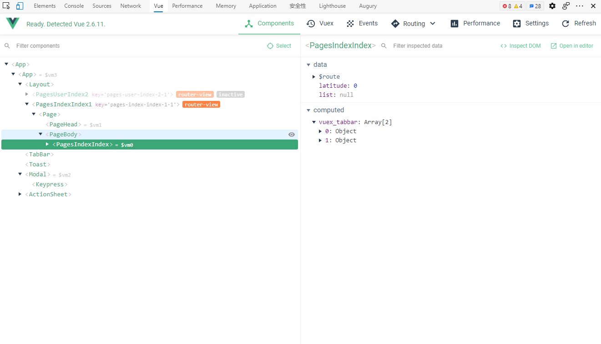

但大家开发的h5网页除了放在普通的浏览器端，其实更多的是放在微信公众号端来进行使用，那微信公众号端的使用，就少不了微信jssdk的使用。那么接下来演示如何在uniapp下使用微信jssdk。

我采用的是vuex的方式来统一管理，不是用微信小程序的globalData，两者都可以。请自行选择。

首先uniapp这边的需要在引入vuex，如何引入自行搜索dcloud的论坛里面的方法，然后开始引入[jssdk](https://ask.dcloud.net.cn/article/35380)到vuex里面。

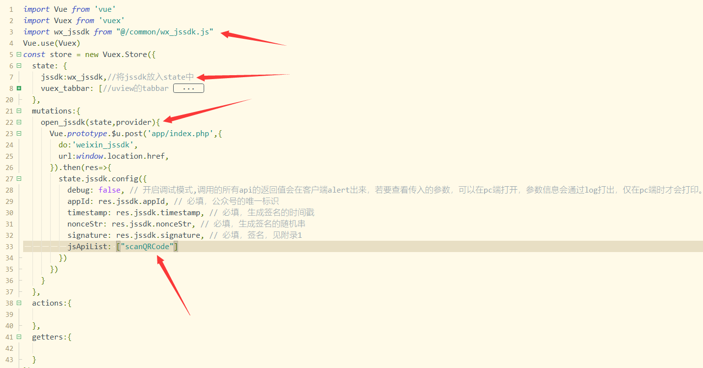

然后在app.vue这边的onLaunch中执行获取config

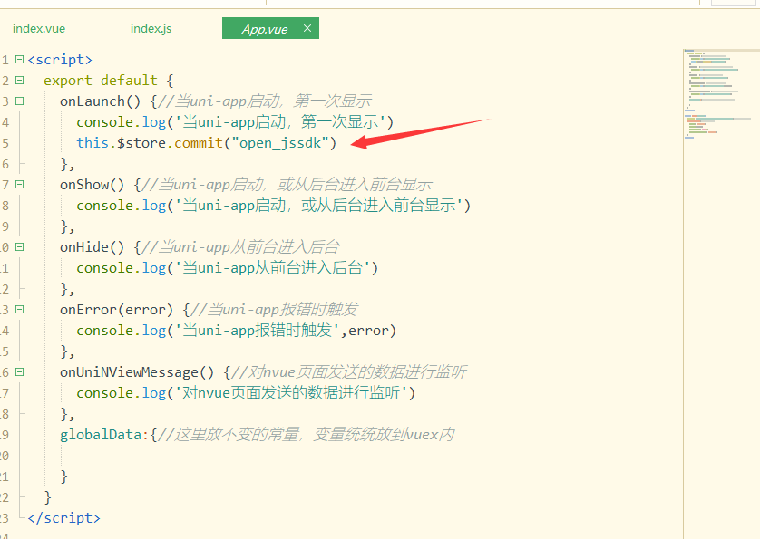


接着在使用页面直接使用即可。这里要强调下，我这边案例里是采用事件触发的方式，而非页面加载就触发，所以可以不需要包裹在ready()函数内，如果你们需求是要页面加载就触发的话，必须要包裹在ready()函数内。

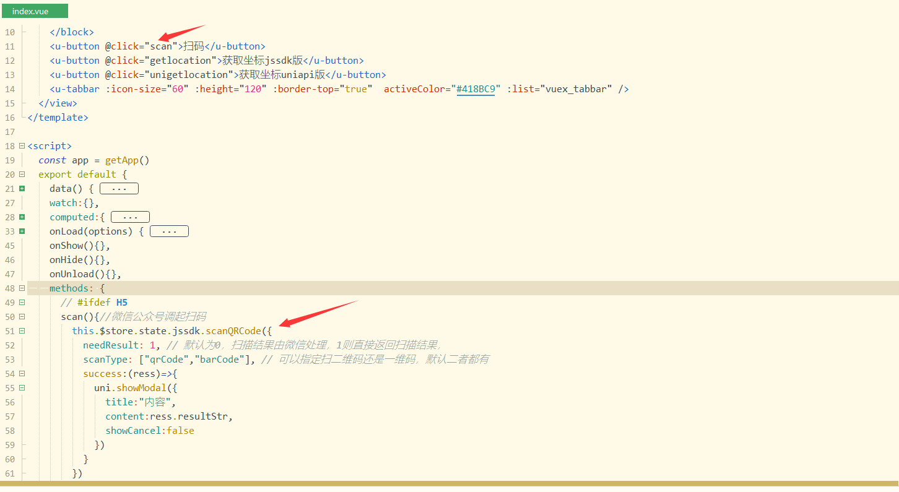

对应的微擎位置的文件和方法如下

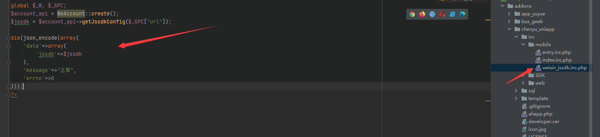

### 微信公众号下的授权登录以及jssdk如何调试
这里我就很简单的一句话，直接使用uniapp的发行功能导出网页文件，再发布到线上环境测试。

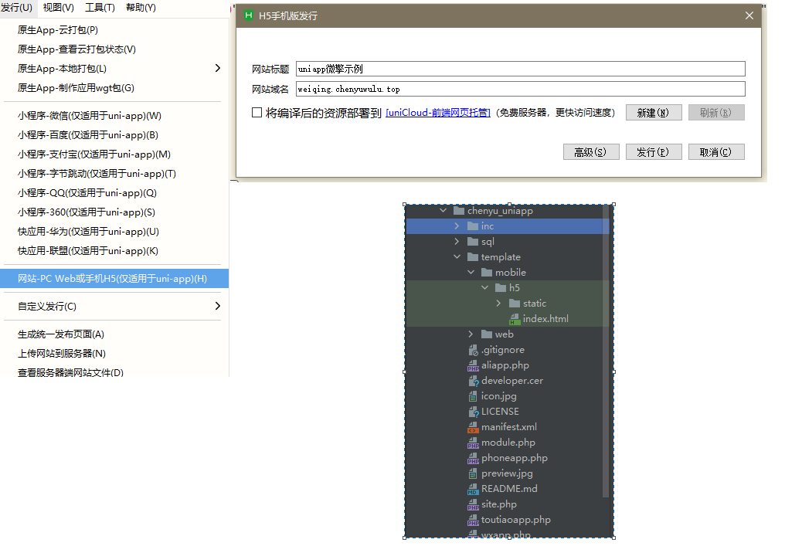

或许有人会觉得，那调试起来岂不是每一次小改动都需要保存，发布，再传ftp到服务器下，流程岂不是超级烦杂，直接修改host，用域名拦截重定向不行吗？自然是可以，但这种操作在实际开发中，对前端来说，没太大意义，很多时候你可以写mock或者简洁点直接写个死数据来开发调试，代价绝对比经常修改host来开发要划算。

另外关于如何进行微信公众号授权登录，这个在你发布线上版之后，记得把之前微擎的bootstrap.app.inc.php中注释的部分还原回来，这样，在进入微信公众号网页的时候，先进微擎的php方法来获取授权登录，再跳转到index.html，就实现了使用微擎搭配uniapp的微信公众号功能。

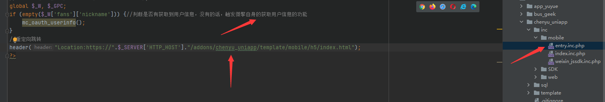

### 关于如何发布微擎商城的公众号模块问题

由于大部分人是需要开发完毕后上线微擎商城来售卖的，但是我前面的开发逻辑以及最后的发布逻辑，都是写在siteinfo.js里面的，并不是从微擎这边拿的，这就导致你发布到微擎商城后，域名和uniacid无法动态的根据用户自己的id来改变。

那我这边针对这个情况作了一定的修改，和前面的流程图会有些不同。在uniapp这边，将http.interceptor.js文件修改为从storage中获取配置和域名

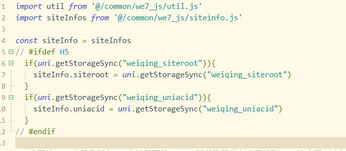

接着在微擎处将原本的跳转入口文件改成如下

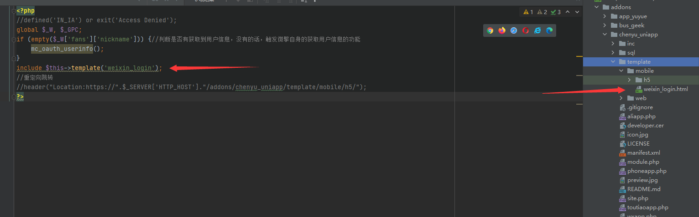

在weixin_login.html里面，写入uniacid和域名

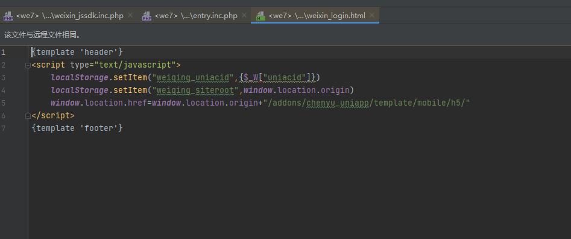

之所以采用这种做法，是因为，虽然多跳了一个页面，但域名是同一个，storage是通用的，所以可以通过这种方式来获取到后端这边配置的域名和uniacid