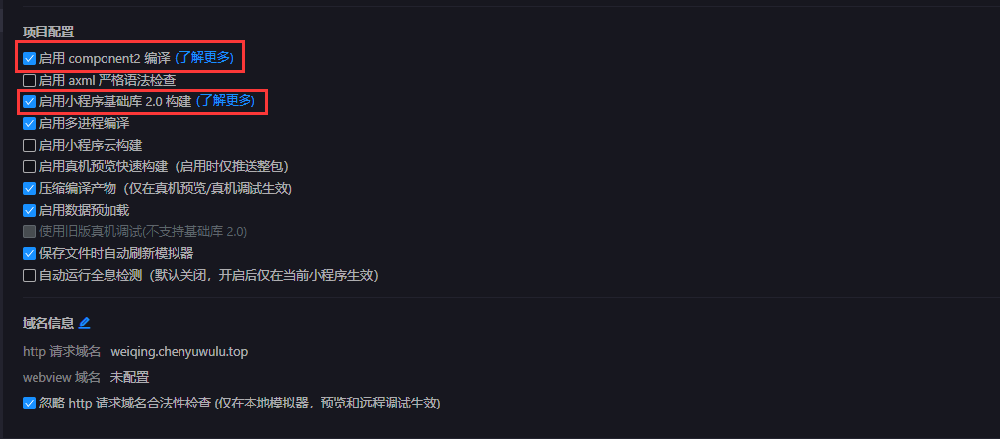
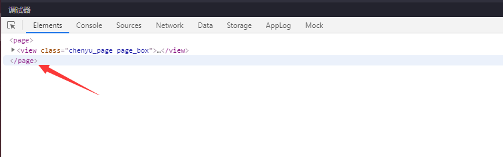
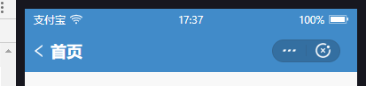

# 支付宝小程序

## 如何使用
1. 通过`HBuilderX`工具打开`uniapp_project`文件夹
2. 将`/common/we7_js/siteinfo.js`中的支付宝小程序的部分改为自己微擎后端对应的数据
```js
// #ifdef MP-WEIXIN
const siteInfo = {
    'name': 'chenyu_uniapp', //你的模块名称
    'title': '',//标题名
    'uniacid': '4',//微擎区分公众号，小程序，app等平台的id
    'acid': '4',//微擎区分公众号，小程序，app等平台的id
    'multiid': '0',
    'version': '1.0.0',//版本号，和你后台创建的版本号要对应
    'siteroot': 'https://weiqing.chenyuwulu.top/app/index.php'//你的微擎域名地址
}
// #endif
```
3. 根据`HBuilderX`工具所提供的运行功能，运行对应的阿里小程序开发工具查看。

## 基本概念
我相信几乎所有人开发支付宝小程序，都是在有微信小程序开发基础的前提下才去开发的，或者我可以自信点，把几乎二字去掉。那在用uniapp开发支付宝小程序的时候，肯定会按照微信小程序的开发习惯去开发，其实在总体上是没错的，可一运行就会爆红，出错，大家见得也绝对不少，因为明明在微信那边没有问题。

那怎么避免或修复那些问题呢？我的回答就一个：<font size=5>耐心的去看一遍支付宝小程序的文档！！</font>

原因有很多，可能是阿里要避嫌，为了和微信不一样而做了改动，也可能是其他，但现实就是有不一样，这些不一样会让你开发困难。这不是uniapp能解决的，是支付宝小程序先天性的问题。

## 问题摘要

### 1.支付宝小程序调试工具



按照目前各家小程序框架的发展，现在很多现成组件库，以及逻辑方法，以及uniapp的特性，为了能使用就需要勾选这两项。支付宝这边有历史兼容问题，可能以后就会自动勾选了，但目前还是需要自己查看下是否勾选了这两个。

### 2.布局差异



起码在我编写文档不久前，支付宝小程序的布局就是没有外围的page标签，这就导致，如果你习惯了用微信小程序的page标签来布局页面，在支付宝这边是不存在这个标签，所以会导致布局错位。

但我图中确实有page，说明支付宝小程序也改了，是一直改成这样还是临时这样，我无法保证，但这个page问题确实困扰了开发支付宝小程序的人好几年。



支付宝是不存在隐藏标题栏的，但支付宝有让标题栏透明的选项，但标题栏占位的地方依旧还是有，这个对于很多要做沉浸式标题栏的人就是很大的布局兼容点。

### 3.API差异

关于API的差异，我几乎是没法配图说明了，因为API上的差异是在太大，比如其他小程序要求的button触发才能获取到用户的openid，支付宝这边不叫openid，叫user_id。然后支付宝小程序这边不是通过按钮获取，而是通过直接调api去获取，相当于以前微信小程序老版本的获取方式。但里面却没有用户名和头像。用户名和头像却要用button来获取。

诸如此类的问题有很多，回到最初的说明，<font size=5>要多看文档！！！</font>

## 微擎的操作内容

微擎这边针对支付宝小程序的api文件就是在aliapp.php内。方法定义和调用和我在微信小程序文档处讲的一样，并且关于如何自己解密支付宝小程序的案例，已经放在了此示例中。可自行查看。