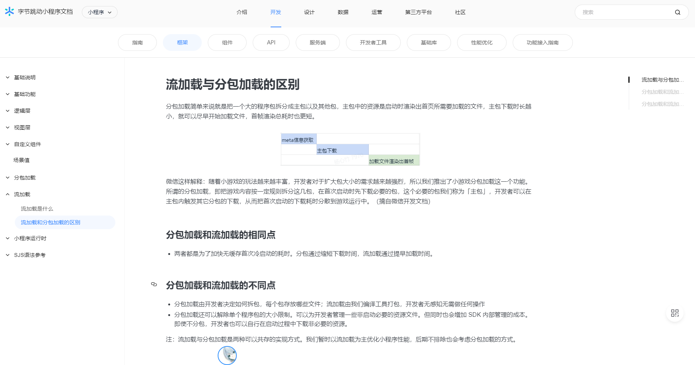

# 字节跳动小程序

## 如何使用
1. 通过`HBuilderX`工具打开`uniapp_project`文件夹
2. 将`/common/we7_js/siteinfo.js`中的字节跳动小程序的部分改为自己微擎后端对应的数据
```js
// #ifdef MP-TOUTIAO
const siteInfo = {
    'name': 'chenyu_uniapp', //你的模块名称
    'title': '',//标题名
    'uniacid': '8',//微擎区分公众号，小程序，app等平台的id
    'acid': '8',//微擎区分公众号，小程序，app等平台的id
    'multiid': '0',
    'version': '1.0.0',//版本号，和你后台创建的版本号要对应
    'siteroot': 'https://weiqing.chenyuwulu.top/app/index.php'//你的微擎域名地址
}
// #endif
```
3. 根据`HBuilderX`工具所提供的运行功能，运行对应的字节跳动小程序开发工具查看。

## 基本概念

字节跳动小程序的设计理念一开始是直接抄微信的作业，后面又想要走另类路线，现在又回来和微信一起走差不多的路线。

这里我说一个冷知识，关于小程序的分包机制。现在大家对于小程序的分包机制应该都是来自微信小程序的分包概念，但在微信推出他的分包概念后，好一段时间内字节跳动走的是流加载逻辑，并且是没有分包逻辑的，可自行文档翻查。



流加载模式确实比分包模式要好，起码对开发者来说利大于弊，无需去细分哪些在主包，哪些在分包。但市场是现实且残酷的，因为是微信先做大了小程序这块蛋糕，微信就是主推他的分包逻辑，就不采用你的流加载模式。所以对于我开发者来说，我一个写小程序的，自然是能发的平台多多益善，况且微信的流量比字节跳动的更有价值。所以字节跳动的这个反而另类，增加我开发负担。

现在字节跳动小程序同时支持流加载和分包，算是一种妥协吧。

之所以拿分包举例子，主要是强调，字节跳动小程序早期确实是直接照着微信小程序结构出的，后面又想走更好的路子，但发现开发者习惯改不过来，于是乎又得跟微信一条路子走。所以在做兼容的时候，一定要有这个概念，出现的bug也方便修复。

## 如何开发调试