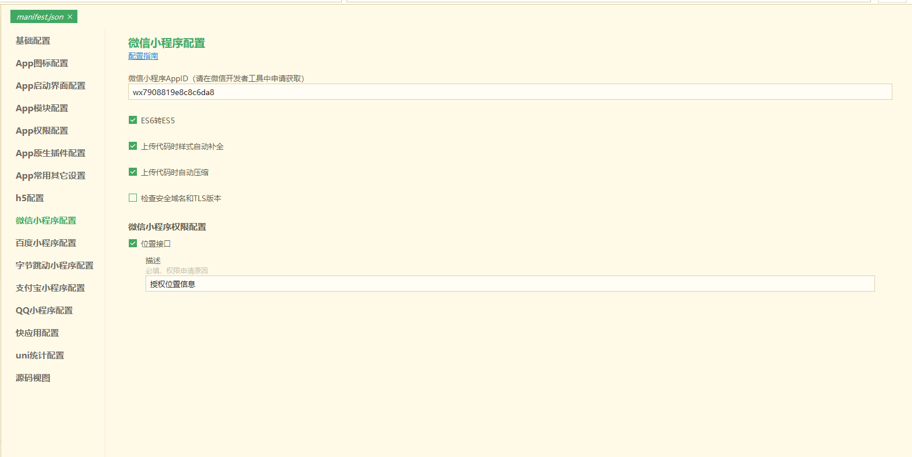
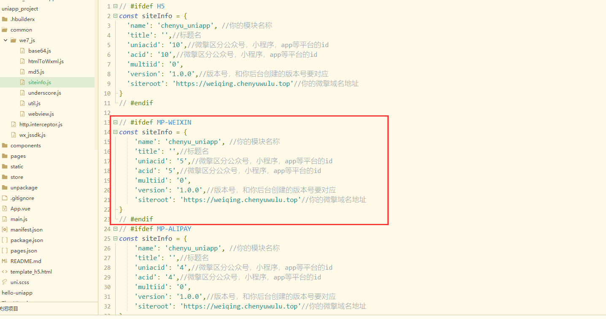
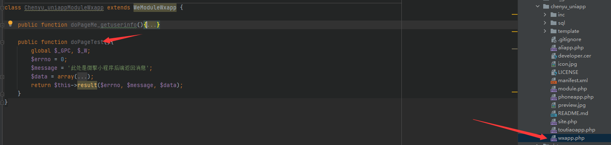
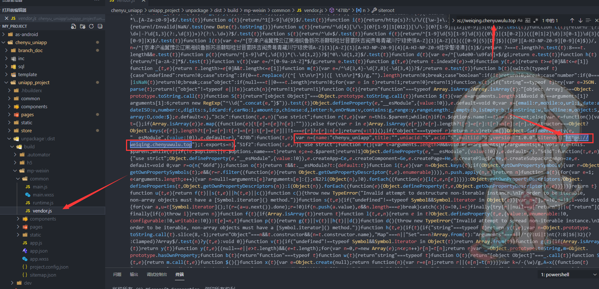
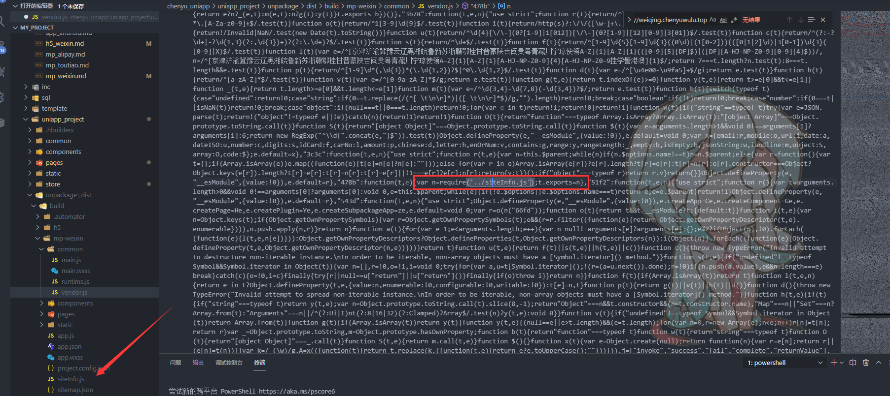
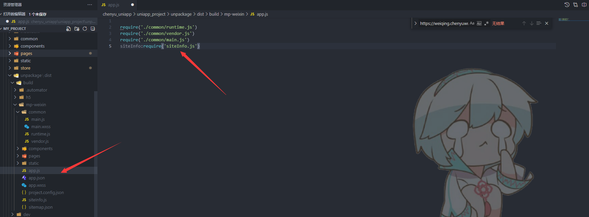

# 微信小程序

## 如何使用
1. 通过`HBuilderX`工具打开`uniapp_project`文件夹
2. 将`/common/we7_js/siteinfo.js`中的微信小程序的部分改为自己微擎后端对应的数据
```js
// #ifdef MP-WEIXIN
const siteInfo = {
    'name': 'chenyu_uniapp', //你的模块名称
    'title': '',//标题名
    'uniacid': '5',//微擎区分公众号，小程序，app等平台的id
    'acid': '5',//微擎区分公众号，小程序，app等平台的id
    'multiid': '0',
    'version': '1.0.0',//版本号，和你后台创建的版本号要对应
    'siteroot': 'https://weiqing.chenyuwulu.top/app/index.php'//你的微擎域名地址
}
// #endif
```
3. 根据`HBuilderX`工具所提供的运行功能，运行对应的微信小程序开发工具查看。

## 基本概念
uniapp下开发微信小程序是要优于在原生的微信小程序下进行开发的，除了uniapp本身的跨端兼容之外，最主要是在保留了大部分小程序结构的好用的地方下，还引入了vue下好用的各类概念和语法糖，比如uniapp就不需要手动setData，框架本身会帮你处理。

**<font color=#840228 size=4>
本示例的微擎服务器是正常的线上服务器，能用https正常访问的线上服务器，如果是采用本地模拟环境的话，请自行替换后面说的服务器概念。
</font>**

## 如何开发调试
### 前期准备
**<font color=#2585a6 size=3>uniapp端的操作</font>**



并且将siteinfo.js关于微信小程序的部分改成自己微擎后端的uniacid和域名，并且在小程序里version的概念是有的，所以version的版本号要和微擎后端的对应。



**<font color=#2585a6 size=3>微擎端的操作</font>**

在wxapp.php文件内编写方法即可，不需要做其他的操作，dopage后面的英文就是方法名



### 开发过程

整体开发流程中，既可以使用微信小程序逻辑为主的结构，也可以用vue为主的结构，或者两者混用都行，但要注意uniapp只是微信小程序的二次创作的框架，基础要是依照微信小程序来的，所以微信小程序做不到的东西，uniapp自然也做不到。


### 关于如何发布微擎商城的模块问题

由于uniapp打包编译导出的微信小程序文件结构里是不包含siteinfo.js的，但因为微擎为了严格规范，必须让siteinfo独立成一个文件来进行控制，所以需要我们后期处理一下。或许有人好奇，能不能用webpack的忽略静态文件方式去实现，让uniapp打包不要把siteinfo文件混入到vendor.js文件里去，并且dcloud的论坛和很多人都说可以做到。

但我实验过后，发现是做不到的，忽略确实可以忽略，但没法忽略根目录下的单个js文件，能忽略static这种目录级别的，然后微擎有强行要求siteinfo是在根目录，所以就是做不到。只能自己后期添加上去。

首先大家打包导出后，直接去翻查vendor.js，然后搜索自己的微擎域名，正常情况下就一个匹配记录，如下



此时会发现红框内的就是我们原先独立在外的siteinfo的数据，那把这部分给删掉，改成我们自己从外界引入siteinfo.js,当然，记得要手动在外部创建好对应的siteinfo.js



接下来还需要在app.js里面手动在引入一遍siteinfo，这一步并不是真的引入，是微擎的检查机制回来查询app.js里有没有引入，如果没有引入，微擎会认为你的模块不合规范从而无法发布到市场。但其实我们的实际siteinfo引入是在vendor.js里的，这里的引入只是用来通过审查用的而已。


